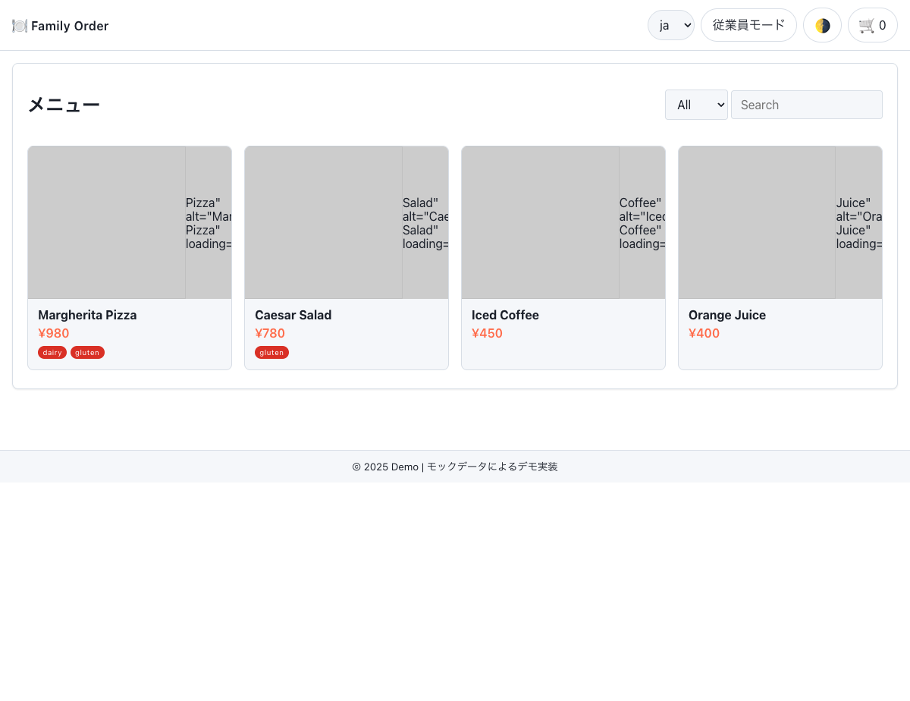

# E2E テストシナリオ

[Playwright MCP](https://github.com/microsoft/playwright-mcp) を活用して、[Spec Driven Flow シナリオ](../spec_driven_flows/README.md)で実施したウェブフロントエンドの E2E テストコードを自動生成します。

## Case1. テストコードを作成する

1. [Spec Driven Flow シナリオ](../spec_driven_flows/README.md)で生成したフロントエンドをローカルで起動します。(Live Server など)
2. Playwright MCP を起動します
3. [仕様書](../../spec/spec-process-family-restaurant-ordering-frontend.md)を読み込ませます
4. 以下のプロンプトを GitHub Copilot の playwright-tester モードで実行してください。

```text
#file:spec-process-family-restaurant-ordering-frontend.md の要求仕様を元に作られた以下で動作しているフロントエンドウェブアプリの E2E テストコードを Python で作成してください。
http://127.0.0.1:5500/scenarios/spec_driven_flows/generated/
作成したコードは scenarios/e2e_test/generated 以下のディレクトリに格納してください。
```

**実行ログの抜粋**

````text
最後に、作成されたファイルの一覧を確認しましょう。 完璧です！家族向けレストラン注文システムの E2E テストコードを作成しました。

## 作成した E2E テストの概要

### 🎯 主な成果

1. **完全な E2E テストスイート**: 仕様書の全要件をカバーするテストコード
2. **Page Object Model**: 保守性の高いテスト構造
3. **包括的なテストカバレッジ**: 機能、パフォーマンス、ユーザビリティテスト
4. **CI/CD 対応**: GitHub Actions 用ワークフロー
5. **詳細なドキュメント**: README と実行手順

### 📁 作成されたファイル構成

\```
scenarios/e2e_test/generated/
├── requirements.txt                          # Python依存関係
├── pyproject.toml                           # pytest設定
├── conftest.py                              # テスト共通設定とPage Objects
├── pytest_plugins.py                       # Playwright設定
├── run_tests.sh                             # テスト実行スクリプト
├── README.md                                # 詳細ドキュメント
├── .github-workflows-e2e-tests.yml         # GitHub Actions設定
└── tests/
    ├── __init__.py
    └── test_restaurant_ordering_e2e.py      # メインE2Eテスト
\```

### 🧪 テスト対象機能

仕様書の以下の要件に対応したテストを作成：

- **REQ-001**: QR スキャン → テーブルセッション開始
- **REQ-002**: カテゴリ別メニュー閲覧・フィルタリング
- **REQ-003**: メニュー詳細（画像、価格、アレルギー情報、オプション）
- **REQ-004**: カート操作（追加、数量変更、削除）
- **REQ-005**: 注文確定と API 送信
- **REQ-006**: 追加注文機能
- **REQ-007**: 会計リクエスト
- **REQ-008**: 従業員注文管理画面
- **品質要件**: パフォーマンス、モバイル対応、多言語対応

### 🏗️ テストアーキテクチャの特徴

1. **Page Object Pattern**: 各画面を独立したクラスで管理
2. **モバイルファースト**: iPhone SE サイズでのテスト実行
3. **マーカーベース分類**: smoke、e2e、integration テストの分離
4. **エラーハンドリング**: 失敗時のスクリーンショット自動保存
5. **CI/CD 準備**: GitHub Actions 用ワークフロー含

### 🚀 実行方法

1. **クイックスタート**:

   \```bash
   cd scenarios/e2e_test/generated
   ./run_tests.sh
   \```

2. **個別実行**:

   \```bash
   # スモークテストのみ
   python -m pytest tests/ -m smoke -v

   # 全E2Eテスト
   python -m pytest tests/ -m e2e -v

   # 統合テスト
   python -m pytest tests/ -m integration -v
   \```

### 🔍 実際の Web アプリ探索結果に基づく実装

テストコードは、実際に以下の機能を探索して確認した内容に基づいて作成されています：

1. ✅ テーブル ID 入力によるセッション開始
2. ✅ カテゴリフィルタ（All、Food、Drink）
3. ✅ メニューアイテム（Pizza、Salad、Coffee、Juice）
4. ✅ メニュー詳細ダイアログ（サイズ選択、数量、アレルギー情報）
5. ✅ カート機能（追加、合計表示、注文確定）
6. ✅ 従業員モード（注文管理、ステータス変更）
7. ✅ 多言語切り替え（日本語、英語、中国語）

この E2E テストスイートにより、レストラン注文システムの品質を継続的に保証し、回帰テストの自動化が可能になります。
````

## Case2. 　 web を徘徊させてテストケースを生成する場合

仕様書などのドキュメントがない場合、Playwright MCP を活用して、対象のウェブアプリを徘徊させてテストケースを生成することも可能です。

1. [Spec Driven Flow シナリオ](../spec_driven_flows/README.md)で生成したフロントエンドをローカルで起動します。(Live Server など)
2. Playwright MCP を起動します
3. GitHub Copilot の Agent Mode で以下のプロンプトを入力します

```text
/playwright-explore-website URL=http://127.0.0.1:5500/scenarios/spec_driven_flows/generated/
```

4. [test-cases-restaurant-ordering.md](./generated/test-cases-restaurant-ordering.md) に探索による調査とテストコードの生成結果が保存されます。




**実行ログの抜粋**

```text
プロンプトの指示に従って、Playwright MCP Serverを使用してウェブサイトを探索し、テスト用の主要機能を特定します。提供されたURL `http://127.0.0.1:5500/scenarios/spec_driven_flows/generated/` にナビゲートして調査を開始します。

まず、ブラウザを起動してURLにアクセスします。 ウェブサイトが正常に読み込まれました。ファミリーレストランの注文システムのデモサイトのようです。ページの概要をスクリーンショットで確認します。 現在のページスナップショットを詳しく確認します。 現在のページ状態がより詳しく見えました。これから5つの主要機能を探索していきます：

## 1. 言語切り替え機能の探索

まず、言語切り替え機能をテストします。現在は日本語（ja）が選択されています。 英語に切り替えてみましょう。 言語が英語に切り替わりました！見出しが「Menu」に、ボタンが「Staff Mode」に、フッターが「Demo with mock data」に変わったことが確認できます。日本語に戻しておきます。 ## 2. カテゴリーフィルター機能の探索

次に、メニューのカテゴリーフィルター機能をテストします。現在は「All」が選択されています。 素晴らしい！「Food」カテゴリーを選択すると、飲み物（Iced Coffee、Orange Juice）が表示されなくなり、食べ物（Margherita Pizza、Caesar Salad）のみが表示されました。

次に「Drink」カテゴリーを試してみます。 「Drink」カテゴリーを選択すると、今度は飲み物（Iced Coffee、Orange Juice）のみが表示されました。カテゴリーフィルター機能が正常に動作しています。

「All」に戻します。 ## 3. 検索機能の探索

次に、検索機能をテストします。「Coffee」を検索してみます。 現在の状態を確認します。 素晴らしい！「Coffee」で検索すると、「Iced Coffee」のみが表示されました。検索機能が正常に動作しています。

検索をクリアしてみます。 検索をクリアすると、すべてのメニューアイテムが再び表示されました。

## 4. 商品をカートに追加する機能の探索

次に、商品をカートに追加する機能をテストします。「Margherita Pizza」をクリックしてみます。 素晴らしい！商品詳細ダイアログが表示されました。このダイアログには以下の要素があります：
- 商品名（Margherita Pizza）
- 商品説明（Classic tomato, mozzarella & basil）
- アレルギー情報（dairy, gluten）
- サイズ選択（S、M、L）現在Sが選択されている
- 数量（現在1）
- 価格（¥880）
- キャンセルとカートに追加ボタン

Mサイズを選択してみます。 Mサイズを選択すると価格が¥880から¥980に変更されました。数量を2に変更してみます。 数量を2に変更すると、価格が¥1,960（¥980 × 2）に更新されました。カートに追加してみます。 素晴らしい！商品がカートに追加され、以下の変更が確認されました：
- カートのカウンターが「0」から「1」に変更
- 「追加しました」という成功メッセージが表示
- ダイアログが閉じられた

## 5. カート機能の探索

カートボタンをクリックしてカートの内容を確認します。 カートダイアログが表示され、以下の詳細が確認できます：
- 商品名：Margherita Pizza
- サイズ：M
- 数量：2（増減ボタン付き）
- 小計：¥1,960
- 合計：¥1,960
- 削除ボタン
- 会計リクエストと注文確定ボタン

数量を減らしてみます。 数量を減らしたことで、数量が2から1に変更され、価格も¥1,960から¥980に更新されました。

カートを閉じます。 ## 追加機能の探索：テーマ切り替え

最後に、テーマ切り替え機能をテストします。 最終スクリーンショットを撮影して、ブラウザを閉じます。 ## 探索結果の要約

Playwright MCP Serverを使用してファミリーレストラン注文システムのデモサイトを探索し、以下の5つの主要機能を特定・テストしました：

### 1. **多言語対応機能**
- **要素**: 言語選択コンボボックス（日本語、英語、中国語）
- **ロケーター**: `page.getByLabel('Language')`
- **期待結果**: UI言語の動的切り替え（メニュー見出し、ボタンテキスト、フッターテキスト）

### 2. **カテゴリーフィルター機能**
- **要素**: カテゴリー選択コンボボックス（All、Food、Drink）
- **ロケーター**: `page.getByLabel('Category')`
- **期待結果**: 選択カテゴリーに応じたメニューアイテムの絞り込み表示

### 3. **検索機能**
- **要素**: 検索テキストボックス
- **ロケーター**: `page.getByRole('searchbox', { name: 'Search' })`
- **期待結果**: 入力キーワードに一致する商品の絞り込み表示

### 4. **商品詳細・カート追加機能**
- **要素**: 商品ボタン、詳細ダイアログ（サイズ選択、数量変更、カート追加）
- **ロケーター**: `page.getByRole('button', { name: '商品名' })`
- **期待結果**: 商品詳細表示、オプション選択、価格計算、カート追加

### 5. **カート管理機能**
- **要素**: カートボタン、カートダイアログ（数量変更、削除、合計計算）
- **ロケーター**: `page.getByRole('button', { name: '🛒' })`
- **期待結果**: カート内容表示、アイテム管理、価格計算

## テストケースの提案

探索結果に基づいて、以下のテストケースを作成します：

Made changes.

## 探索完了の総括

Playwright MCP Serverを使用してファミリーレストラン注文システムを包括的に探索し、以下を達成しました：

### 🔍 **探索した主要機能**
1. **多言語対応**: 日本語・英語・中国語の動的切り替え
2. **カテゴリーフィルター**: All/Food/Drinkによるメニュー絞り込み
3. **検索機能**: リアルタイム商品検索
4. **商品カスタマイズ**: サイズ選択・数量変更・価格計算
5. **カート管理**: アイテム追加・削除・数量変更

### 📋 **作成されたドキュメント**
- 詳細なテストケース仕様書 (test-cases-restaurant-ordering.md)
- 各機能のPlaywright実装例
- エンドツーエンドテストシナリオ
- エッジケースとトラブルシューティング指針

### 🎯 **主要な発見事項**
- **優れたUX設計**: レスポンシブな価格計算、リアルタイムフィードバック
- **アクセシビリティ**: 適切なARIAラベルとセマンティックHTML
- **国際化対応**: 完全な多言語サポート
- **状態管理**: カートとフィルターの一貫した状態保持

### 🧪 **推奨テスト戦略**
1. **単体テスト**: 各機能の個別検証
2. **統合テスト**: 機能間の相互作用確認
3. **E2Eテスト**: 完全な注文フロー検証
4. **パフォーマンステスト**: 応答性と負荷耐性
5. **ユーザビリティテスト**: 実際の使用シナリオ検証

探索により、このウェブサイトは本格的なレストラン注文システムとして十分な機能を備えており、包括的なテストスイートの作成が可能であることが確認されました。
```

### [Playwright MCP Chrome Extension](https://github.com/microsoft/playwright-mcp/blob/main/extension/README.md)

Playwright MCP ブラウザ拡張機能が登場する前は、Playwright MCP サーバーでログイン状態を維持するには、LLM にログイン認証情報を渡す必要がありました。
拡張機能を使えば、既存のブラウザプロファイルを安全に再利用できます。パスワードは不要です。LLM は既に認証済みのセッションに対してテストを実行できます。

- Download link: [microsoft/playwright-mcp/releases](https://github.com/microsoft/playwright-mcp/releases)
- [Testing in a Logged-In State with the Playwright MCP Browser Extension](https://dev.to/debs_obrien/testing-in-a-logged-in-state-with-the-playwright-mcp-browser-extension-4cmg)
- [Playwright MCP + Chrome Extension: Testing with Logged-In Profiles](https://www.youtube.com/watch?v=uE0r51pneSA)

# 参考文献

- [🤖 Awesome GitHub Copilot Customizations](https://github.com/github/awesome-copilot)
  - [chatmodes/playwright-tester.chatmode.md](https://github.com/github/awesome-copilot/blob/main/chatmodes/playwright-tester.chatmode.md)
  - [instructions/playwright-python.instructions.md](https://github.com/github/awesome-copilot/blob/main/instructions/playwright-python.instructions.md)
  - [instructions/playwright-typescript.instructions.md](https://github.com/github/awesome-copilot/blob/main/instructions/playwright-typescript.instructions.md)
  - [prompts/playwright-automation-fill-in-form.prompt.md](https://github.com/github/awesome-copilot/blob/main/prompts/playwright-automation-fill-in-form.prompt.md)
  - [prompts/playwright-explore-website.prompt.md](https://github.com/github/awesome-copilot/blob/main/prompts/playwright-explore-website.prompt.md)
  - [prompts/playwright-generate-test.prompt.md](https://github.com/github/awesome-copilot/blob/main/prompts/playwright-generate-test.prompt.md)
