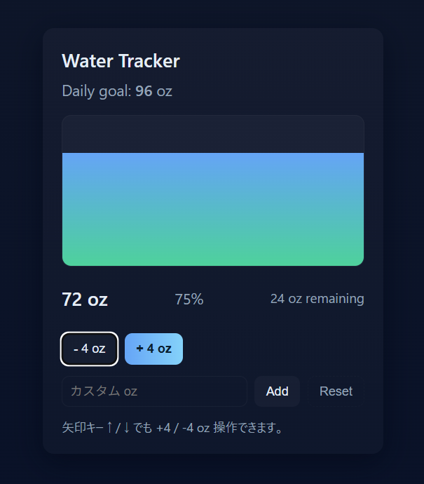
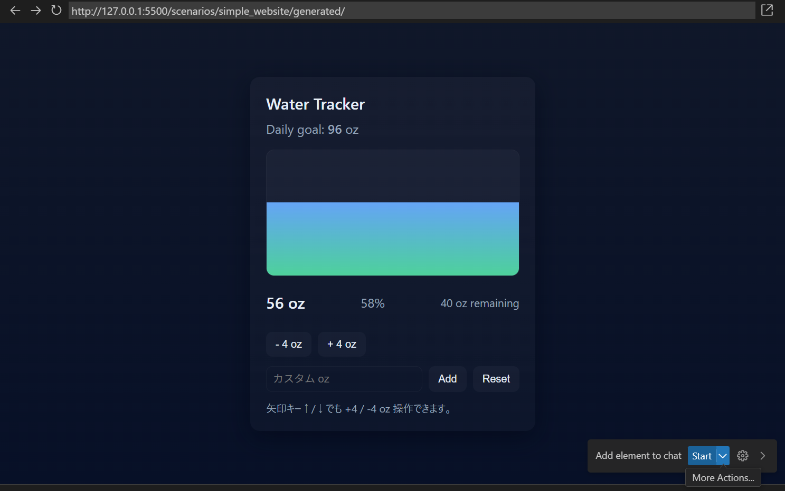

# Simple Website シナリオ

## コード生成

以下のプロンプトを GitHub Copilot に与えて、コードを生成します。

```text
Let's create a basic water tracking app and HTML, CSS and Javascript. I want the ability to increment and decrement my water consumption in ounces against the daily goal of 96 ounces.
All the codes should be inside scenarios/simple_website/generated directory.
```

## 動作確認

[Live Server Visual Studio Code Extension](https://marketplace.visualstudio.com/items?itemName=ritwickdey.LiveServer) から `Open with Live Server` を選択すると、ローカルサーバーが立ち上がり、ブラウザで動作確認できます。ホットリロードもサポートされています。

あるいは、Python を使ってローカルサーバーを立てても良いです。

```shell
# Python
cd scenarios/simple_website/generated
python -m http.server 8888
# access to http://localhost:8888
```

## スクリーンショット



## その他

- `Open Chat in New Window`: GitHub Copilot Chat フォームを別ウィンドウで開く
- `Simple Browser: Show`: ブラウザを開いて要素のコンテキストを追加できる



# 参考文献

- [Agent Mode in Action: AI Coding with Vibe and Spec-Driven Flows | BRK102](https://build.microsoft.com/en-US/sessions/BRK102?source=sessions), [YouTube](https://www.youtube.com/watch?v=1DlNVROQ6DI)
